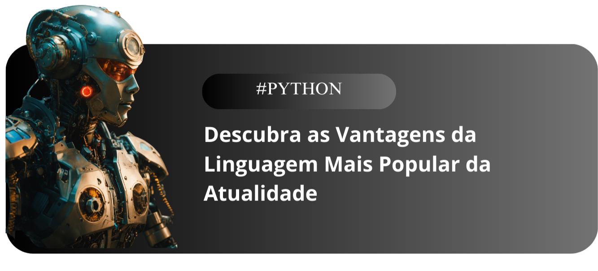

    

 

-----------
## Clique aqui para ler o artigo no [GitHub](https://github.com/MartinsRoni/artigo/blob/main/content.md)

# CHECKLISTA PARA GERAR ARQUIVOS DE QUALIDADE 
- [ ] Definir o assunto
- [ ] Titulo chamativo: Headline
- [ ] Imagem de Capa Chamativa
- [ ] Blocos do artigo
- [ ] Postar o artigo com call to action

## Assunto:
    Python 

## Título 
    Por que Python ? Descubra as Vantagens da Linguagem Mais Popular da Atualidade

## Capa
    Feito com Canva e Lexica.art

## Blocos     

- ### Prompts utilizados 

Comporte-se como um escritos de artigos tech back-end e escreva o artigo atendendo as regras abaixo

    {REGRAS}
    > No maximo 5 linhas por bloco de explicação
    > Explique de maneira simples e objetiva para um publico alvo de 12 á 16 anos 
    > Crie blocos e subititulos para os blocos
    - Faça um call to action para minhas redes sociais 
    - Coloque 3 hashtags que façam sentido

Ilustrações de capa: gerada pela Lexica.art
Conteúdo gerado por: ChatGPT e Revisões humanas
